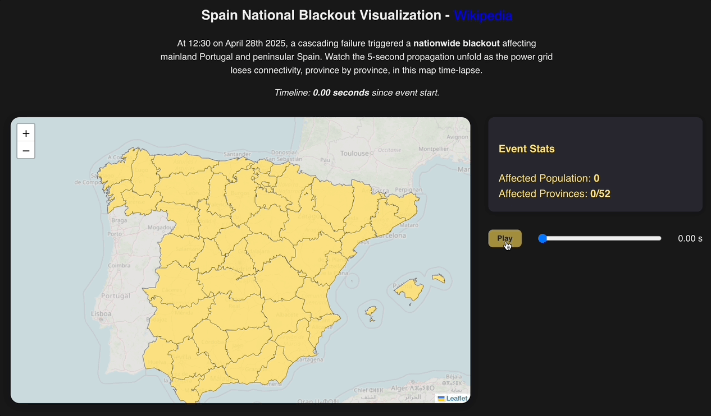

# Spain National Blackout Visualization 🇪🇸⚡

An interactive time-lapse visualization showing the cascading electricity outage that affected Spain over a 5-second period. This project demonstrates how a power grid failure propagated across provinces in real-time.



## Features

- **Interactive Map:** Visualize all Spanish provinces with color-coded power status
- **Time-lapse Animation:** Watch the outage spread over 5 seconds
- **Timeline Controls:** Play, pause, and scrub through the event timeline
- **Information Panel:** Context and explanation of the blackout event
- **Statistics Dashboard:** Real-time metrics showing affected population and provinces
- **Responsive Design:** Works on desktop and mobile devices

## Getting Started

### Prerequisites

- Node.js
- npm

### Installation

1. Clone the repository:

```bash
git clone https://github.com/gianpaj/spain-blackout.git
cd spain-blackout
```

2. Install dependencies:

```bash
npm install
```

3. Start the development server:

```bash
npm dev
```

4. Open [http://localhost:5173](http://localhost:5173) to view it in your browser.

## Project Structure

```
spain-blackout/
├── public/
│   └── spain.json    # Spain provinces geodata
├── src/
│   ├── components/
│   │   ├── MapView.jsx            # Map visualization
│   │   ├── TimelineSlider.jsx     # Timeline controls
│   │   ├── InfoPanel.jsx          # Informational content
│   │   └── StatsCard.jsx          # Statistics dashboard
│   ├── App.jsx                    # Main application
│   ├── blackoutData.js            # Simulation data
│   ├── index.css                  # Global styles
│   └── index.js                   # Entry point
├── package.json
└── README.md
```

## Data Sources

This visualization uses the following data sources:

- **GeoJSON data**: Spanish provinces geographic boundaries
- **Simulated blackout timeline**: Approximate progression of the outage based on grid connectivity patterns

## Extending the Project

Here are some ways you could extend this visualization:

1. **Add Power Grid Overlay**: Add transmission lines as an SVG overlay
2. **Enhanced Animation Effects**: Add particle effects for power flow using canvas or WebGL
3. **Weather Data Integration**: Add weather conditions at the time of the outage
4. **Recovery Timeline**: Add a second timeline showing the recovery process
5. **Real Data Integration**: Replace simulated data with actual grid failure data

## Technologies Used

- [React](https://reactjs.org/) - UI framework
- [Leaflet](https://leafletjs.com/) / [React Leaflet](https://react-leaflet.js.org/) - Interactive mapping
- [GeoJSON](https://geojson.org/) - Geographic data format

## Contributing

Contributions are welcome! Please feel free to submit a Pull Request.

1. Fork the project
2. Create your feature branch (`git checkout -b feature/amazing-feature`)
3. Commit your changes (`git commit -m 'Add some amazing feature'`)
4. Push to the branch (`git push origin feature/amazing-feature`)
5. Open a Pull Request

## License

This project is licensed under the MIT License - see the LICENSE file for details.

## Acknowledgments

- [OpenStreetMap](https://www.openstreetmap.org/) for base map tiles
- Spanish government for provincial boundary data
- [React Leaflet examples](https://react-leaflet.js.org/docs/example-choropleth/)
